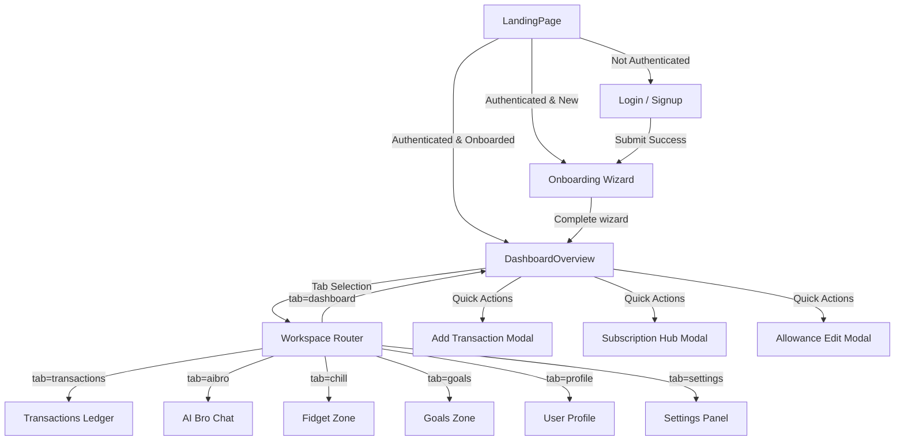

# BreadBuddy: Project Knowledge Transfer Document (KTD)

Welcome to the **BreadBuddy** Project Knowledge Transfer Document. This document serves as a comprehensive reference for the incoming Senior Full Stack Engineer, Product Designer, and Technical Architect. It details the existing implementation, architecture, features, design specifications, and roadmap of BreadBuddy.

---

# 1. Project Overview

## What is BreadBuddy?
BreadBuddy is a gamified, mobile-first personal finance application tailored specifically for college students and Gen-Z. It moves away from standard dry spreadsheet interfaces by framing budgeting as a game ("getting the bread") and offering a companion chatbot ("AI Bro") that provides sassy, Gen-Z financial advice alongside more traditional calm, coaching, or professional advice.

## Product Vision
To empower college students to build sustainable financial habits early in life. By lowering the psychological barrier to logging expenses and goals through micro-interactions, immediate reward systems (XP, streaks, titles), and relatability, BreadBuddy aims to become the go-to companion for youth financial wellness.

## Target Audience
- College students managing restricted pocket money, allowances, or side gig earnings.
- Gen-Z users seeking a visually vibrant, casual, and highly interactive finance application.
- Users who find traditional finance apps overwhelming, boring, or anxiety-inducing.

## Core Philosophy
- **Finance is a game:** Saving money and staying on budget awards experience points (XP) and increases streaks.
- **Immediate Feedback Loop:** Logging an expense is rewarded with visual particle bursts (bread emoji, coin emoji) and immediate level progression feedback.
- **Relatable Communication:** Instead of generic error messages, the UI talks back in Gen-Z slang or chosen persona, acting as a personal check-in.
- **Offline-First Hybrid:** Uses a unified client-side repository structure backed by LocalStorage, with partial synchronization to a local Node.js SQLite server.

## Current Development Stage
- **Phase 1-4 Core Complete:** Frontend routing, tab-based workspace, onboarding wizard, ledger management, goal engine, and gamification system.
- **Phase 5-7 Integrations Complete:** Local SQLite server with Node's native `node:sqlite`, rate-limiting middleware, AI engine parser, Fidget zone, and interactive modals.

## Major Milestones Completed
1. **Dynamic Workspace Layout:** Tab navigation syncs directly with URL search query parameter (`?tab=...`) to prevent state synchronization race conditions.
2. **Onboarding Funnel:** Multi-step wizard collecting allowance, currency, and financial archetype.
3. **Ledger System:** Category-tagged expense and income logs with customizable emojis.
4. **Gamification Pipeline:** Reusable Progression, Streak, Level, and Achievement engines emitting global DOM CustomEvents.
5. **AI Bro Chat Interface:** Context-aware prompt routing engine responding based on user spent-to-allowance ratio, categories, and selected personality.
6. **Stress Chill Zone:** interactive spinner (RPM counter), squishy loaf (with satisfaction phrases), and Pop-It bubble tracker syncing back to database fidget scores.

---

# 2. Complete Feature Breakdown

## Authentication & Onboarding
- **Purpose:** Secure identity management and initial financial profile setup.
- **Current Functionality:**
  - Standard email/password forms with rate-limited login, registration, password recovery mock routes, and verification.
  - Multi-step onboarding collecting: User's name, currency choice (default: ₹), monthly allowance, and financial archetype/vibe (e.g., Chill Saver, Spender, Bread Legend).
- **Internal Architecture:**
  - Managed by `client/src/features/auth/` and `client/src/features/onboarding/Onboarding.tsx`.
  - Onboarding state is verified via [onboardingEngine.ts](file:///client/src/lib/onboardingEngine.ts) using `localStorage` flags and API user records.
- **Future Extensibility:** Direct integration with Google/GitHub OAuth, session refreshes, and SMS otp verification.

## Dashboard Overview
- **Purpose:** Primary hub displaying the current financial status and progression at a glance.
- **Current Functionality:**
  - Displays remaining pocket money, spent progress bar, and "Safe Spend" limit of the day.
  - Hosts the Progression card (XP progress, Level, Title), active Streak card, and Savings snapshots.
  - Renders a monthly spending chart split by category.
- **Internal Architecture:**
  - Implemented in [DashboardOverview.tsx](file:///client/src/features/dashboard/DashboardOverview.tsx) and associated components inside `client/src/features/dashboard/components/`.
  - Re-fetches database summary on any `finance-updated` global window event.

## Transactions & Ledger
- **Purpose:** Transaction tracking categorized by type (income vs. expense).
- **Current Functionality:**
  - Modal for logging transactions with title, description, category (e.g., Food 🍕, Transport 🛺, Shopping 👟), payment method, and amount.
  - Searchable list of transactions with category filtering.
- **Internal Architecture:**
  - Uses [financeEngine.ts](file:///client/src/lib/financeEngine.ts) and [financeRepository.ts](file:///client/src/repositories/financeRepository.ts).
  - Triggers an `expense-added` event which launches a 15-particle emoji explosion in the UI.

## Savings Era (Goals Zone)
- **Purpose:** Target-based savings tracking.
- **Current Functionality:**
  - Create savings goals with name, target amount, emoji, and target date.
  - Fund goals directly from the remaining allowance, generating a corresponding transaction under the `savings` category.
  - Auto-archives goals upon reaching 100% completion.
- **Internal Architecture:**
  - Implemented in [savingsEngine.ts](file:///client/src/lib/savingsEngine.ts) and [GoalsZone.tsx](file:///client/src/features/goals/GoalsZone.tsx).
  - Rewards XP (`create_goal` = 25 XP, `fund_goal` = 15 XP, `complete_goal` = 100 XP) and verifies achievements.

## Subscriptions Hub
- **Purpose:** Tracking monthly and annual recurring commitments.
- **Current Functionality:**
  - Logs active, paused, or cancelled subscriptions (Netflix, Spotify, etc.) with custom bill date, recurrence cycles (weekly, monthly, custom days/months), and reminders.
  - Calculates total monthly subscription drain and compares it to allowance limits.
- **Internal Architecture:**
  - Defined in [subscriptionEngine.ts](file:///client/src/lib/subscriptionEngine.ts) and [SubscriptionHubModal.tsx](file:///client/src/features/dashboard/components/SubscriptionHubModal.tsx).

## Financial Health Index
- **Purpose:** Objective score evaluating student saving habits.
- **Current Functionality:**
  - Combines allowance ratio, goals funded, active streaks, and subscription drain to calculate a health score out of 100.
  - Renders feedback cards with green/amber/red zones, 3 positive habits, and 2 areas of improvement.
- **Internal Architecture:**
  - Evaluated in [wellnessEngine.ts](file:///client/src/lib/wellnessEngine.ts).

## AI Bro Companion
- **Purpose:** Conversational money assistant.
- **Current Functionality:**
  - Suggests predefined questions (e.g., "Can I afford this?", "Where is my money going?").
  - Personality switcher: Gen-Z Slang ("toast/roast" modes), professional analyst, financial coach, or calm guide.
  - Reads total cashflow, latest expenses, and patterns to deliver context-aware, highly personalized replies.
- **Internal Architecture:**
  - Backend execution in [chatbot.ts](file:///client/src/server/src/ai/chatbot.ts) and frontend fallback in [aiBroEngine.ts](file:///client/src/lib/aiBroEngine.ts).
  - Utilizes keyword density models and pattern analyzers to detect user intent (e.g., `afford_check`, `prediction`, `motivation`, `girl_math`).

## Stress Chill Zone (Fidget Zone)
- **Purpose:** Playful zone to release financial anxiety.
- **Current Functionality:**
  - Interactive spinner that calculates rotational velocity (RPM) and boosts fidget score.
  - Squishy Bread Loaf that morphs expressions and floats reassuring quotes upon click.
  - Pop-It bubbles with satisfying pop states, auto-resetting with point multipliers.
  - Syncs the points to the server with a 1.5s debounce timer.
- **Internal Architecture:**
  - Implemented in [FidgetZone.tsx](file:///client/src/features/chill/FidgetZone.tsx) using requestAnimationFrame for smooth physics.

---

# 3. Application Flow



---

# 4. Folder Structure

```
college-finance-ai/
├── client/                     # Frontend Application
│   ├── public/                 # Static assets
│   ├── src/
│   │   ├── App.tsx             # Application router & event listener hub
│   │   ├── main.tsx            # DOM mounting and Toast provider wrapping
│   │   ├── animations/         # Framer motion transitions config
│   │   ├── components/         # Reusable layouts and base UI widgets
│   │   │   ├── ui/             # Atomic design components (Card, Button, etc.)
│   │   │   └── feedback/       # Loader layouts, skeleton loaders, and empty states
│   │   ├── configs/            # Gamification constants & configs
│   │   ├── engines/            # Logic controllers for gamification (XP, Streak)
│   │   ├── features/           # Modularized domain logic and pages
│   │   ├── hooks/              # Global React hooks
│   │   ├── layouts/            # App navigation headers and shells
│   │   ├── lib/                # Core calculation libraries (API client, AI, Savings)
│   │   ├── repositories/       # LocalStorage data synchronization Layer
│   │   ├── storage/            # Serialization configuration files
│   │   ├── styles/             # Global Tailwind stylesheets
│   │   └── types/              # Domain-specific TypeScript declarations
│   ├── package.json
│   ├── tailwind.config.js
│   └── tsconfig.json
└── server/                     # Backend API Server
    ├── data/                   # SQLite database storage directory
    ├── src/
    │   ├── index.ts            # Express configuration & routes wiring
    │   ├── ai/                 # Local rules-based NLP engines and fallback prompts
    │   ├── db/                 # Database instances and schema setup
    │   ├── middleware/         # Security & rate limiting filters
    │   └── routes/             # Controller routes mapping
    └── package.json
```

---

# 5. Core Architecture

The architecture separating UI from calculations is structured as follows:

```
[UI Layer (React Component / Feature)]
              │
              ▼
[Engine Layer (e.g. financeEngine, savingsEngine)]
              │
              ▼
[Repository Layer (e.g. financeRepository, savingsRepository)]
              │
              ▼
[Storage Layer / API Client (StorageAdapter / LocalStorage / Server DB)]
```

### Storage Layer Decoupling
The database layer is decoupled using the `StorageAdapter` interface:
- **`StorageAdapter`** defines `getItem`, `setItem`, `removeItem`, and `clear`.
- **`LocalStorageAdapter`** implements this interface locally.
- **`defaultStorageAdapter`** is injected into the repository classes to allow transparent API swap-outs without modifying repository class signatures.

---

# 6. Event System

Global DOM events are leveraged to keep separate, decoupled cards on the dashboard updating instantly without props-drilling:

| Event Name | Emitter | Listener(s) | Purpose |
| :--- | :--- | :--- | :--- |
| `expense-added` | TransactionModal / Ledger | App.tsx | Spawns a floating particle burst of emojis near the add button. |
| `finance-updated` | TransactionModal / GoalsZone / SavingsEngine | Dashboard.tsx | Refreshes the monthly dashboard budget overview cards immediately. |
| `xp-updated` | XPEngine | UserProfile / ProgressionCard | Triggers UI level trackers, showing the new XP progression score. |
| `progression-updated` | ProgressionEngine | ToastProvider / UI | Notifies other components of current streak metrics and level-ups. |
| `achievement-unlocked` | AchievementEngine | ToastProvider | Pushes an iridescent achievement notification card on screen. |

---

# 7. State Management

- **Local State:** Component-specific view controllers (active filters, input values) use standard React `useState`.
- **Global Vibe:** Managed in `App.tsx` and distributed to child routes.
- **Persistence Pipeline:**
  1. The UI calls the `Engine`.
  2. The `Engine` processes constraints (e.g., validating funds, adjusting XP) and invokes the `Repository`.
  3. The `Repository` uses `StorageAdapter` to save structural data.
  4. Local data is serialized as JSON strings with namespace prefixes:
     - `breadbuddy_transactions_${userId}`
     - `breadbuddy_goals_${userId}`
     - `breadbuddy_streaks_${userId}`
     - `breadbuddy_xp_${userId}`

---

# 8. Data Models

### User
```typescript
interface User {
  id: number;
  email: string;
  name: string;
  monthlyAllowance: number;
  currency: string;
  vibe: 'toast' | 'roast';
  fidgetScore: number;
  created_at: string;
}
```

### Transaction
```typescript
interface Transaction {
  id: number;
  amount: number;
  currency: string;
  type: 'income' | 'expense';
  category: string;
  title: string;
  description?: string;
  date: string; // YYYY-MM-DD
  time: string; // HH:MM
  paymentMethod: string;
  emoji: string;
  created_at: string;
}
```

### Goal
```typescript
interface Goal {
  id: number;
  title: string;
  emoji: string;
  target_amount: number;
  current_amount: number;
  target_date: string | null;
  archived: boolean;
  created_at: string;
}
```

### Subscription
```typescript
interface Subscription {
  id: number;
  name: string;
  emoji: string;
  cost: number;
  amount: number;
  billingDate: number; // day of month
  category: string;
  status: 'active' | 'paused' | 'cancelled' | 'archived';
  frequency: 'weekly' | 'every_2_weeks' | 'monthly' | 'every_2_months' | 'quarterly' | 'every_6_months' | 'yearly' | 'custom';
  interval?: number;
  intervalType?: 'days' | 'months';
  nextDueDate: string;
  reminderEnabled: boolean;
}
```

---

# 9. Current UI Structure

- **Landing Page:** Interactive, glassy landing screen showing value propositions, a custom features showcase, and call-to-actions.
- **Login / Signup / Forgot Password:** Clean card layout with floating gradients, input validation, and password strength indicators.
- **Onboarding Panel:** A multi-step questionnaire that locks out the main dashboard until complete.
- **App Layout Shell:** Responsive grid with persistent left sidebar on desktop and bottom navigation bar on mobile devices.
- **Dashboard Overview:** Displays:
  - Daily pocket allowance card with spending speedometer.
  - Progression card with a custom level bar.
  - Streak visualizer showing completed activity milestones.
  - Interactive "Save Spend Today" indicator.
- **Transaction Modal:** Centered overlay with amount validation, payment selector, and custom emoji picker.
- **Subscription Hub Modal:** Recurring item list displaying billing days and monthly drain calculators.

---

# 10. Current Design Language

- **Visual Theme:** Glassmorphism over dark space elements (`#0D0D11`).
- **Color Accents:**
  - **Toxic Lime:** `#A3E635` / `rgb(163, 230, 53)` - Used for savings, successes, and level ups.
  - **Neon Coral:** `#F87171` / `rgb(248, 113, 113)` - Used for budget deficits, deletions, and warning alerts.
  - **Iridescent Pink/Lavender:** `#F472B6` / `#C084FC` - Used for gamification elements and AI Bro messaging headers.
- **Glassmorphism:** Card containers use `backdrop-filter: blur(16px)` with thin white transparent borders (`border-white/10`) and background filters (`bg-white/[0.03]`).
- **Typography:** Sans-serif Inter/Outfit typeface alongside styled monospaced numerical elements for pocket money displays.
- **Micro-Animations:** Hover scale enhancements on buttons, active page indicator shifts, and custom particle explosions.

---

# 11. Technical Decisions

- **Decision 1: Tab state in URL search parameters (`?tab=...`)**
  - *Why:* Prevents state synchronization bugs between sub-widgets and layout menus. Ensures browser navigation back/forward support out of the box.
- **Decision 2: Rules-based local chat processing alongside API routes**
  - *Why:* Provides an instant response mechanism and ensures chat functionality remains usable even when offline.
- **Decision 3: Using Node.js Native SQLite (`node:sqlite`)**
  - *Why:* Zero external database dependencies needed for deployment. Simple SQL interface utilizing native sqlite library modules in Node.js v22+.

---

# 12. Current Technical Debt

1. **Dual Chat Engine Implementations (Medium Severity):** Duplicate intent parsing logic exists between `client/src/lib/aiBroEngine.ts` and `server/src/ai/chatbot.ts`.
2. **Hybrid Offline/Online Synchronization Gaps (High Severity):** Actions logged offline in LocalStorage do not automatically synchronize to SQLite once connection is restored.
3. **Large Onboarding Component (Low Severity):** `Onboarding.tsx` contains too many layout elements and should be split into smaller, dedicated sub-steps.

---

# 13. Future Integration Readiness

- **Supabase Swap-out:** The decoupled `StorageAdapter` allows for replacing LocalStorage with Supabase database queries in a single class file swap.
- **Google OAuth:** Auth middleware structures allow adding token generation and social verification routes easily.
- **Deployment:** The server port auto-increments upon port collisions, which makes it compatible with simple Docker setups.

---

# 14. Missing Documentation

1. **Product Requirements Document (PRD):** Documenting target metrics and success ratios.
2. **Technical Reference Document (TRD):** Detailed database migrations structure.
3. **API Contracts Schema:** Swagger/OpenAPI documentation for the backend.
4. **UX Spec Guidelines:** Complete animation curves and interactive feedback rules.

---

# 15. Suggested Phase 8 Foundation

- **PRD Foundation:** Focus on features tracking social saving, peer allowance comparisons, and custom recurring rewards.
- **TRD Foundation:** Transition sqlite schemas to Supabase database structures.
- **UX Foundation:** Refine and document glassmorphic CSS classes and emoji particles parameters.
- **Deployment Planning:** Configure a reverse proxy (e.g. Nginx) routing `/api` requests to Express and index page requests to Vite's static build.
